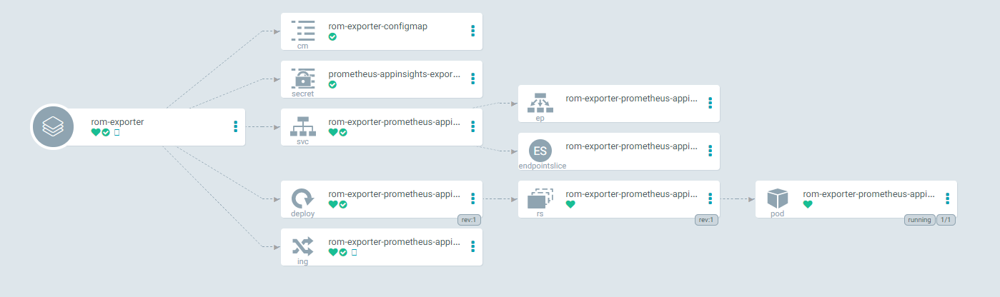

<p align=center></p>

<h1 align="center">Bringing Azure ApplicationInsight metrics to Prometheus.</h1>

<p align="center">
    <a href="./LICENSE" rel="nofollow"></a>

# helm-charts
Helm Charts to deploy kubernetes apps.

To use this chart repo. Install helm and run

```
helm repo add  romiko https://romiko.github.io/helm-charts
helm install romiko/prometheus-appinsights-exporter
```

## Prometheus AppInsights Exporter
This chart will allow you to export metrics from Azure AppInsights into Prometheus.

* Download the chart.
* Update the values.yaml file
* Setup your queries in the files/queries.yaml


<p align=center></p>

# Contribute
Currently the query support is very limited. It will be great to support Counters, Gauages, Summaries, Histograms etc

# Other Charts here
If you see other charts in the source code here but not in the index. Feel free to update the index with the shell script.
# helm-charts-
# helm-charts
